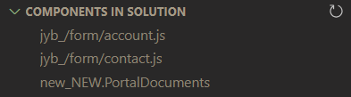
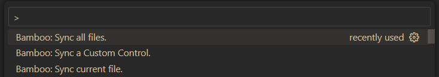
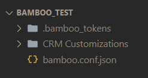

# Bamboo 

Bamboo is a simple, friendly, and ⚡*blazingly*⚡ fast customization manager, designed to speed up development time on the [Microsoft Power Platform](https://powerplatform.microsoft.com/en-us/).

Currently supporting [web resources](https://learn.microsoft.com/en-us/power-apps/developer/model-driven-apps/web-resources) and [custom controls](https://learn.microsoft.com/en-us/power-apps/developer/component-framework/create-custom-controls-using-pcf), Bamboo provides a seamless experience for developers to edit and manage these solution components - all from within VS Code.

## Features
Bamboo provides the following features inside VS Code:

- Create or update web resources.
- Publish web resources automatically.
- Add web resources to a solution automatically.
- Manage custom controls (PCF components) through the import + publish of solutions.
- List all web resources and custom controls in a given solution in a VS Code tree view.


#### Component Tree


#### Commands


## Getting Started

1. Install the extension [here](https://marketplace.visualstudio.com/publishers/root16).
2. Add a `bamboo.conf.json` at the **root** of your VS Code workspace.
    
    - **Do not check `bamboo.conf.json` into source control.**
3. Populate the json file with the following data:

```json
{
    "baseUrl": "https://<org>.crm.dynamics.com",
    "solutionUniqueName": "<your-solution-name>",
    "credential": {
        "type": "ClientSecret",
        "clientId": "<your-client-id>",
        "clientSecret": "<your-client-secret>",
        "tenantId": "<your-tenant-id>"
    },
    "webResources": [
        {
            "dataverseName": "new_/forms/account.js",
            "relativePathOnDisk": "path/to/new_/forms/account.js"
        },
        {
            "dataverseName": "new_/forms/contact.js",
            "relativePathOnDisk": "path/to/new_/forms/contact.js"
        },
        ...
    ],
    "customControls": [
        {
            "dataverseName": "new_NEW.ControlOne",
            "relativePathOnDiskToSolution": "path/to/ControlOneSolution.zip",
            "solutionName": "ControlOneSolution"
        },
        {
            "dataverseName": "new_NEW.ControlTwo",
            "relativePathOnDiskToSolution": "path/to/ControlTwoSolution.zip",
            "solutionName": "ControlTwoSolution"
        },
        ...
    ]
}
```

4. Reload VS Code
    - *Everytime a configuration change is made to `bamboo.conf.json` VS Code needs to be re reloaded*

### Authentication Methods Supported

| Authentication Scheme | Currently Supported |
|----------|----------|
| Client Id / Client Secret    | ✅   |
|  OAuth   | ❌   |


## **Important Notes** 
- All paths must use the `/` seperator.
- `baseUrl` must *not* end with a `/`.
- The [app registration](https://learn.microsoft.com/en-us/power-apps/developer/data-platform/walkthrough-register-app-azure-active-directory#confidential-client-app-registration) specified must have:
    - Access to the specified Dataverse environment
    - The appropiate Security Role necessary to:
        - Upload solutions
        - Publish solutions
        - Upload web resources
        - Publish web resources
        - Add components to solutions
- `relativePathOnDisk` and `relativePathOnDiskToSolution` must *not* start with a `/`.
- For web resources, `dataverseName` and `relativePathOnDisk` don't *need* to be similar (as shown in the example), this is just encouraged for ease of development

## Usage

| Command | Title 
|---------|-------|
| `bamboo.syncCurrentFile` | Sync current file. (Must be present on conf.) |  
| `bamboo.syncAllFiles` | Sync all files. (Each file present in the conf.) | 
| `bamboo.syncCustomControl` | Sync a Custom Control. (Opens up a choice dropdown for each control specified in the conf.) | 

- All command can be run in the command palette.


## Token Refresh + Cache
- Bamboo can use the previously cached token to speed up initial load times.
- Add the file: `<vscode-workspace>/bamboo_tokens/tokenCache.json` and then restart VS Code.

## Extension Settings

| Property | Type | Default | Description |
|----------|------|---------|-------------|
| `bamboo.general.messageVerbosity` | `string` | `"low"` | Set the verbosity level of how many messages are displayed. |
| `bamboo.general.listSolutionComponentsOnStartup` | `boolean` | `false` | When the extension is loaded, list all supported solution components in the currently selected solution in a tree view. |
| `bamboo.webResource.publishAfterSync` | `boolean` | `true` | When syncing a web resource, publish after a successful upload. |
| `bamboo.customControl.publishAfterSync` | `boolean` | `true` | When syncing a custom control solution, publish after a successful upload. |


## Feature List

- [X] Upload / create web resources
- [X] List Web Resources in tree view 
- [X] List Custom Controls in tree view 
- [X] Upload Custom Controls via Solution Import 
- [ ] Upload Custom Controls via PAC or individual import 
- [ ] Automatically add custom controls to solution 
- [ ] Manage upload / sync from context of tree view
- [ ] Sync data from Power Apps to local files
- [ ] Plugin support

## License
Distributed under the MIT License. See [`LICENSE`](LICENSE) for more information.

## Contact
- [Open an Issue](https://github.com/Root16/bamboo/issues/new)
- [Project Link](https://github.com/Root16/bamboo)

## Contributing
- This project is intended to benefit the Power Platform community as well as Root16's internal developers. 
- Contributions are most welcome.
- *But*, issues, fixes and feature requests are **not** guaranteed.
- **Use at your own risk: This software is provided "as is," without warranty of any kind, express or implied. Use it at your own discretion and responsibility.**